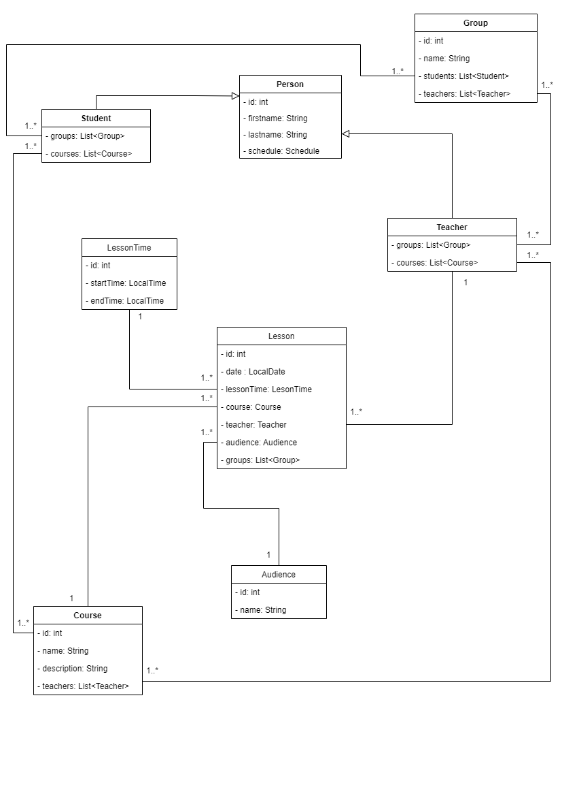

# University class diagram

# User Stories 

##### 1. Teacher can view own schedule flow.
*Given user is logged on as Teacher*
- User can see and navigate to `MySchedule` menu
- User should see own Teacher schedule according with selected date/range filter
- User can see own Teacher schedule according with selected groups or all groups

##### 2. Student can view own schedule flow.
*Given user is logged on as Student*
- User can see and navigate to `MySchedule` menu
- User should see own Student schedule according with selected date/range filter
- User can see own Student schedule according with selected courses/teachers or all schedule

##### 3. User can view alert flow
*Given user input wrong password or username*
- User can see an authentication page explaining the credential issue
- User can try login one more time

##### 4. User can change the time of the lessons
*Given user is logged on as Teacher*
- User can see and navigate to `MySchedule` menu
- User should see own Teacher schedule according with selected filters
- User schould see `Change schedule` button
- User should see `edit schedule` flow after clicking the `Change schedule` button
- User can change the time of the lessons on `edit schedule` flow

##### 5. User 'A' can change another user role
*Given user 'A' is logged on as Admin*
- User should be able to see `Admin panel` page
- User should be able to see all users data, such as `id`, `username` and `role` in table
- User should be able to see `Change role` button for all users in table
- User can click `Change role button`
- User should be able to see `edit user` page after clicking `Change role` button
- User should be able to change role for selected user